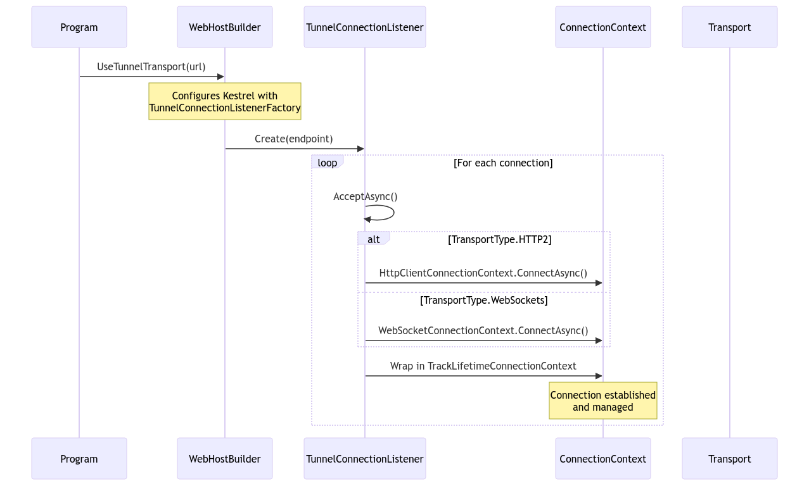

## Component Overview

- **Program.cs**: Entry point that configures the WebHost with tunnel transport
- **WebHostBuilderExtensions**: Configures Kestrel to use the tunnel transport system
- **TunnelConnectionListener**: Core component that manages connections to the proxy
- **Connection Contexts**:
  - **HttpClientConnectionContext**: Handles HTTP/2 connections
  - **WebSocketConnectionContext**: Handles WebSocket connections
  - **TrackLifetimeConnectionContext**: Wraps connections to track their lifetime

## Transport Types

The system supports two transport types:
1. **HTTP/2**: Default transport using HTTP/2 protocol
2. **WebSockets**: Alternative transport using WebSocket protocol

Each transport type is handled by its respective connection context class, which manages the underlying connection details and protocol-specific behaviors.

## Detailed Connection Flow

